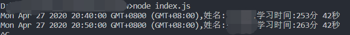

# 大学语文工具

有人叫我帮他写一个刷大学语文时长的工具,顺便学学npm和js

## 使用说明
本工具需要校园网环境

1. 替换用户名密码
    
    替换```index.js```里面的用户名和密码
    ```javascript
    //用户名
    let name = "username";
    //密码
    let pwd = "password";

    ```
2. 安装依赖
    
    使用npm安装依赖
    ```npm
    npm install
    ```
3. 运行
    ```nodejs
    node index.js
    ```

## 截图
